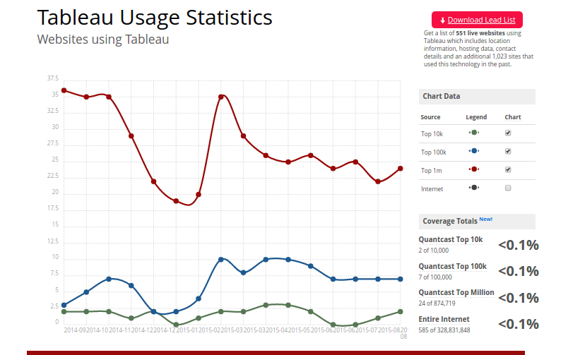
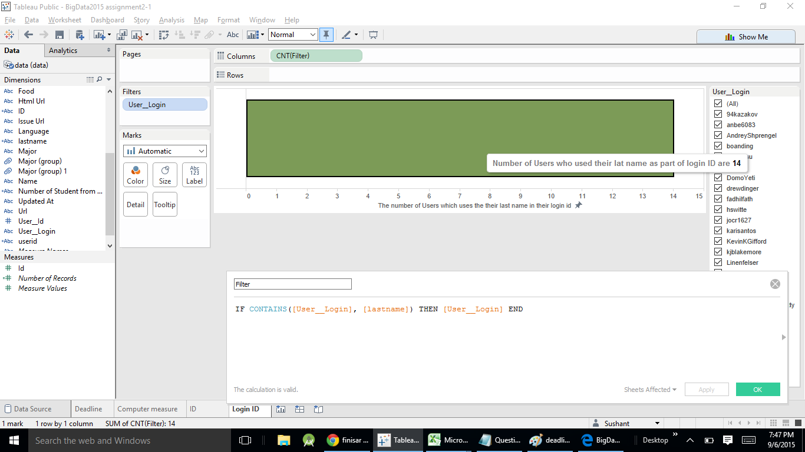
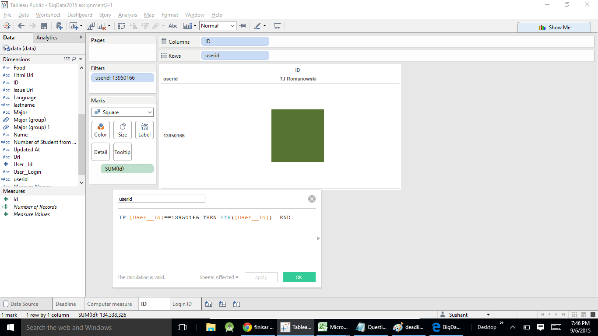
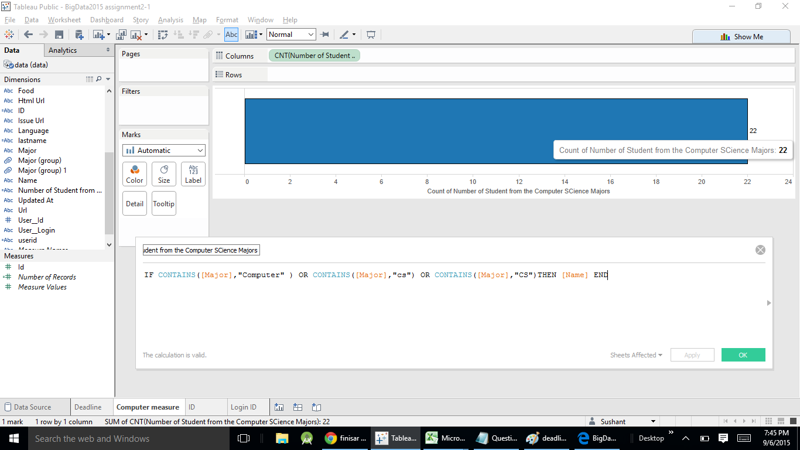
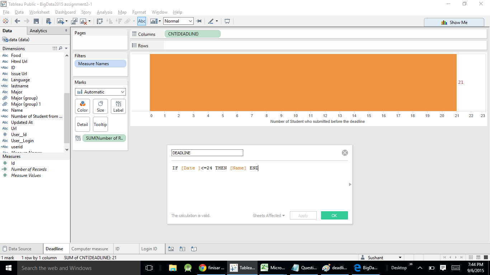

# Tableau Visualization

Tableau is arguably the biggest deal now in terms of data visualization for non-programmers.
Let's pretend you are not a programer. Learn and experience what it is like to make
visualizations using Tableau to answer the same questions about your classmates in our course.

For each of the question, think about what chart you should use to convey your answer and
make your best effort to create something that makes sense to you. There's no right
or wrong. When we meet in the class again, we will set aside time for each team to discuss
and compare the variety of visualization solutions each member has come up with for the
same set of questions. It will be fun!

To include a Tableau visualization in your report, take a screenshot, save it as an image,
put it in the `learning/week2` folder, and replace ``  with
your own image. Please makes sure your screenshot includes the _entire_ Tableau interface
including the controls, widgets ...etc.

# How big the deal Tableau really is?
Tableau is being used by many big comapnies for their data analysis part,here bellow the screenshot of 1 stats showing the number of companies which uses the Tableau 

#
# who has used their last name as the user github id?

Answer of this question is given on the ToolTip in the above screenshot i.e. 14.

# who has the id 13950166

Answer of this question is in the second column i.e  TJ Romanowski in the ablove screenshot 

#How many people are from  computer science major

Answer of this question is given on the ToolTip in the above screenshot i.e. 22.

#How many ppl submitted on and befor the deadline 8/24/15

Answer of this question is written in front of the yellow bar in the ablove screenshot i.e. 21.
