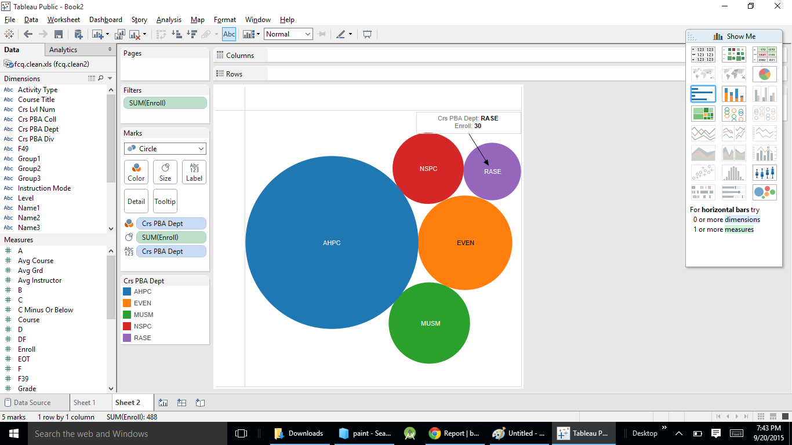
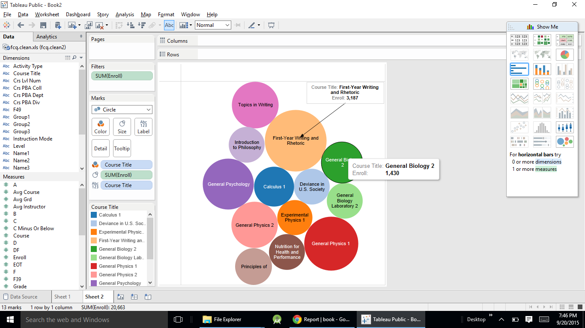
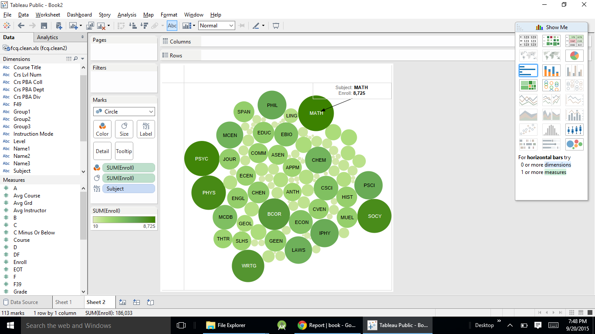
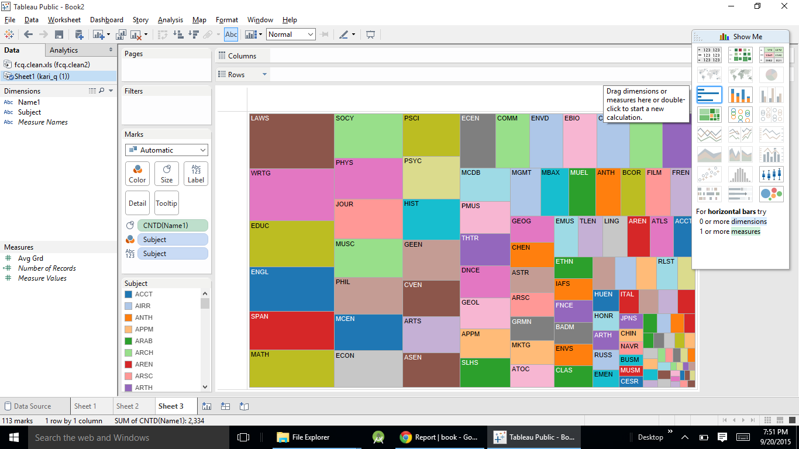
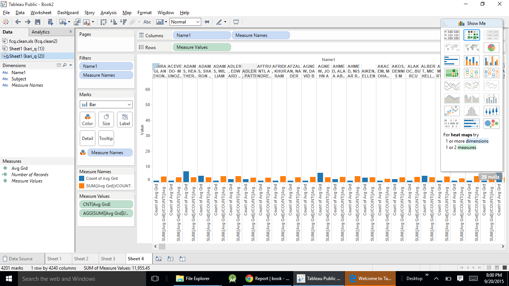

# Visualization

Using Tableau, create visualization for each question in the report. You will
work on this independently just like last week.

To include a Tableau visualization in your report, take a screenshot, save it as an image,
put it in the `learning/week2` folder, and replace ``  with
your own image. Please makes sure your screenshot includes the _entire_ Tableau interface
including the controls, widgets ...etc.

# Import

Data: [fcq.clean.json](https://github.com/bigdatahci2015/book/blob/master/hackathons/fcq/fcq.clean.json)

(a copy of this file is in your book repository already in the directory `hackathons/fcq`)

This dataset is provided to you in the JSON format. Your first task is to figure out
how to transform this JSON file into a format that can be fed into Tableau. As
a junior and senior, you are expected to be able to look around the Internet
to problem solve.

# # (Question 1)# Which department has the lowest enrollment? by John Raesly

The answer is indicated marker in diagram 

#  Which course has the highest enrollment?by andrew

The answer is indicated marker in diagram 

# Which subject is most in demand,based on the total number of enrollment?by Sushant Mittal

The answer is indicated marker in diagram 

# How many instructors have taught each subject?
 by (KariSantos)

If you see the marker on color blocks,there you can find tha answersw

# Does the Instructor tends to give out higher grades if they teach more classes? or the reverse?(Question 5)

The graph shows avergae grade and the class size comparaion by the bar chart 
